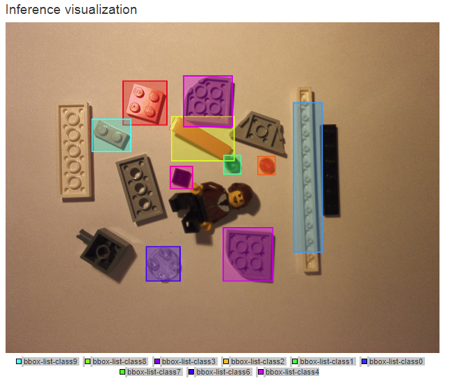

# Inference
## Udacity Term 2 Inference Project

A multi-class lego detector using a GoogLeNet detector with inception modules.Below is a sample forward pass showing detections with bounding boxes.

